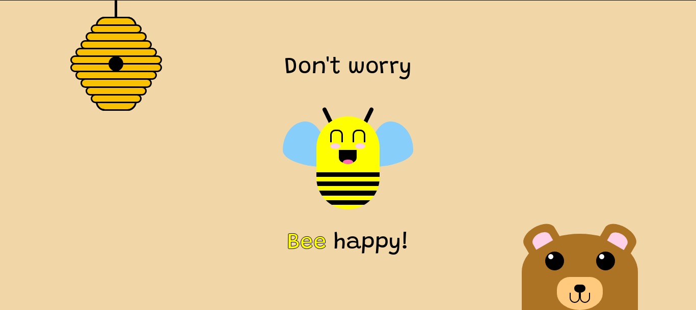

# 🎨 [CSS Art](https://github.com/bugahontas/css-art) / Bee happy!


## ✨ Preview



## ✨ Source code

- [HTML file](https://github.com/bugahontas/css-art/blob/main/bee-happy/bee-happy.html)
- [CSS file](https://github.com/bugahontas/css-art/blob/main/bee-happy/bee-happy.css)

**Wanna the source code on your machine?** You have two options:
- Fork and clone this repository to your local machine (but **I'm not accepting PRs in this repo**, so please keep any changes in your machine)
 
Or  

1. Open the file;
2. Click on the ```raw``` button at the top-right corner of the file;
3. Click on the right button of your mouse and choose "select everything" or select everything manually;
4. Paste the code in your favorite code editor and have fun! 😊 

