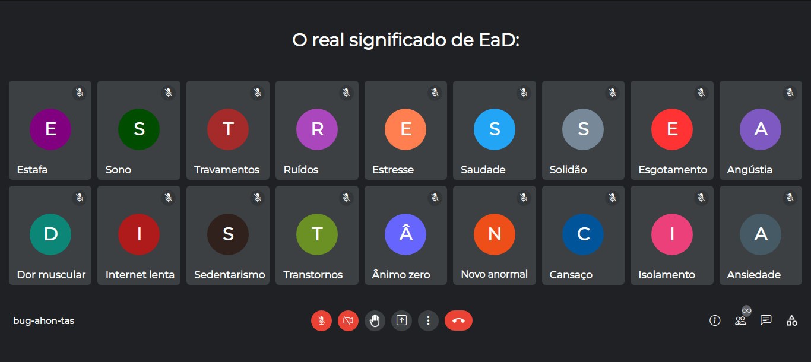

# 🎨 [CSS Art](https://github.com/bugahontas/css-art) / EaD


## ✨ Preview



## ✨ *Behind the scenes*: artwork meaning

*EaD* is a Brazilian acronym for *Educação a Distância* (Distance Education or E-learning), that is, online classes. 

So, this artwork is a critic about common problems faced by many students and teachers, specially during the coronavirus pandemic, like stress, pains, technical problems and loneliness. 

In Brazil, the most used platform for online classes is Google Meet, in which each participant has your own avatar showing a personnal photo or simply the initial letter of your first name. 

Here, the artwork reproduces a Google Meet screen where each participant is a problem, and each of them has a initial letters that, together, form the expression *Estresse a Distância* (Long-distance stress) instead of *Educação a Distância*. That's a well known and very funny pun here in Brazil! 😂           

## ✨ Source code

- [HTML file](https://github.com/bugahontas/css-art/blob/main/ead/ead.html)
- [CSS file](https://github.com/bugahontas/css-art/blob/main/ead/ead.css)

**Wanna the source code on your machine?** You have two options:
- Fork and clone this repository to your local machine (but **I'm not accepting PRs in this repo**, so please keep any changes in your machine)
 
Or  

1. Open the file;
2. Click on the ```raw``` button at the top-right corner of the file;
3. Click on the right button of your mouse and choose "select everything" or select everything manually;
4. Paste the code in your favorite code editor and have fun! 😊 

